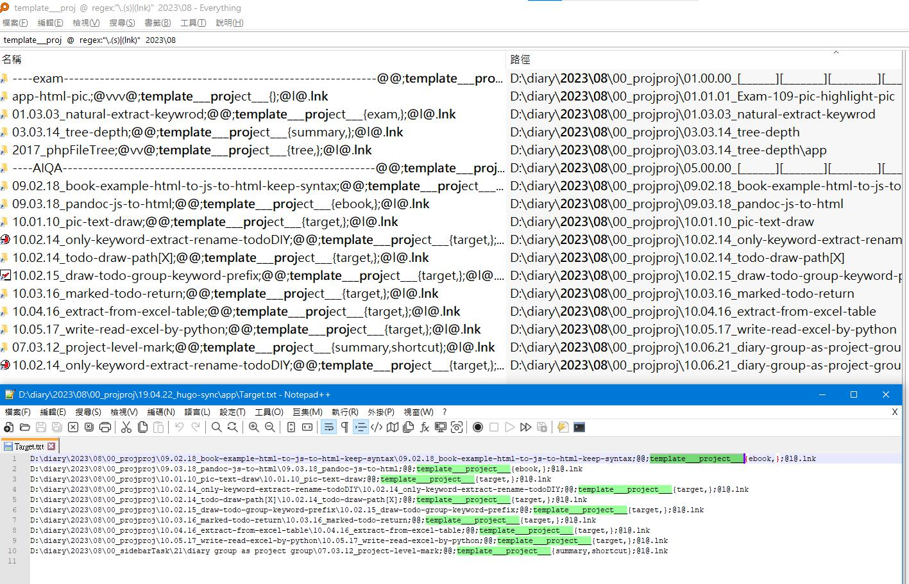
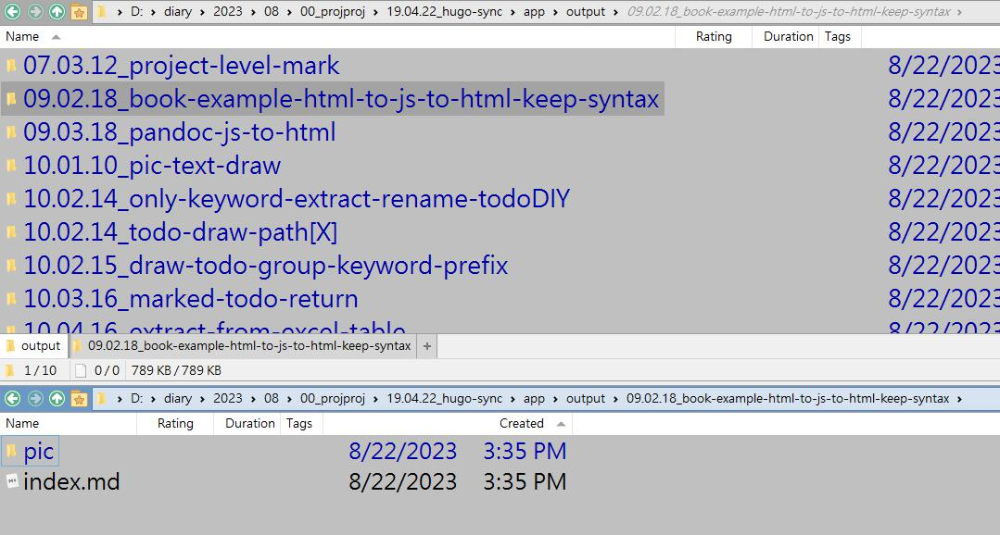
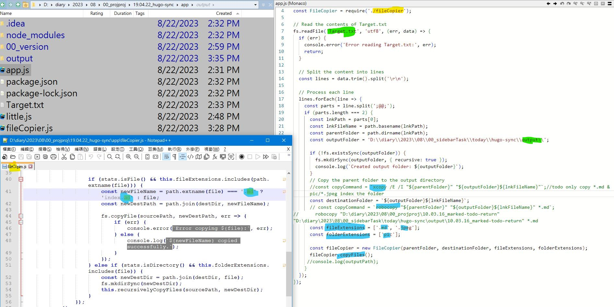
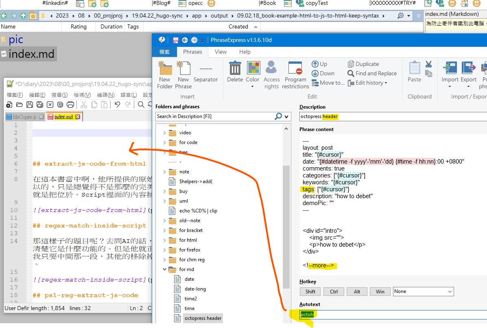

## this-month-project-to-share 

好的，有關於網誌這件事情的最後一步，就是每一個月做完的東西都可以了，丟上去讓別人看得到。這是一個過去，一直想要做的畫面。那我們可以透過everything serach的方式呢，**搜尋到這個月的所有專案類的作品**。找到他們之後就準備丟上去了。

## output-exclude-rename-md 

那丟上去以前呢？我們需要過一些**過濾的動作**，因為其實我們並不需要全部的檔案都一起上傳，我們**只需要說明的文件呢，跟他的圖片檔案**就可以了。並且文件的部分，就稍微改一下名字哦，那這樣子的更動是很少的，幾乎是完全不用變動了，很符合當初想要做到的。**直接丟上去就不用去管，圖片的位置不用另外放**。

## input-clone-to-output-exclude 

那我們就來實際寫一次程式吧。道理也蠻簡單的，就是有輸入端嘛，輸入端的話，有你專案的位置，我們是以讀取文字檔的方式去當做輸入。然後在你輸出以前呢？我們要先做一些一些檔案的過濾動作，那本來測試了兩個指令了，但是這兩個看似比較單純的指令呢，會牽扯到一些。資料夾的問題。所以最後我就自己寫了一個。另外獨立成一個module。功能也蠻單純的，就只是限制我們要同步的檔案的型別是什麼以及什麼樣的資料夾是我們想要同步的。限制好你要進行同步的答案之後呢，就可以準備輸出了。

## md-front-matter 

那麼，在你完成之後。就剩下。一些所謂的標籤的部分。這是最後輸出在網址上所必要的，包含**關鍵字,日期**。這些讓你上傳上去之後，需要拿**來分類的一些內容**。那過去的話，我們是用**phraseexpress透過一些快速熱鍵插入**的方式來插入這些標記。那麼接下來我覺得我應該會在進行同步的時候啊。甚至是在**同步以前呢，就先把這些標記給產生好**。這可能**不是通過手寫的方式**，而是。讓他從他的一些檔案啊，以及**上下階層關係呢來產生**這些必要的內容。

# todo